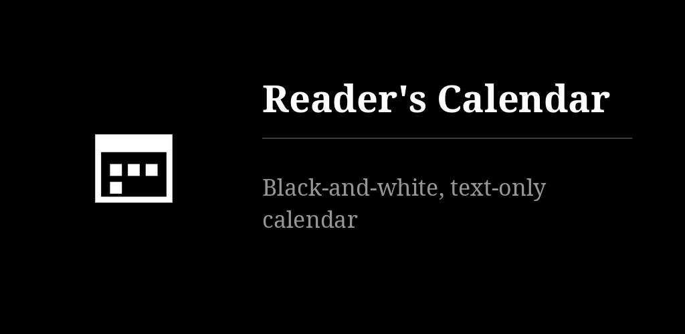
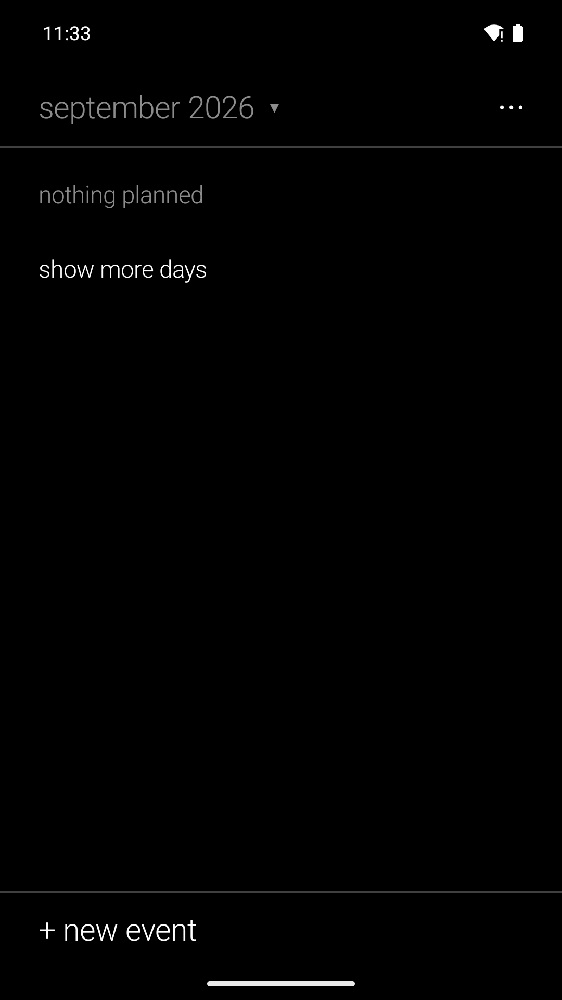
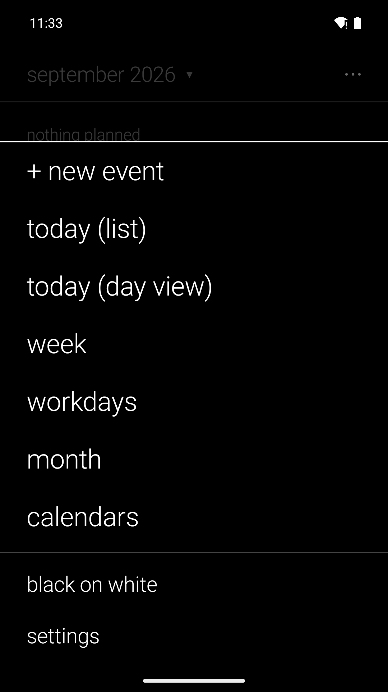

# Reader's Calendar

Shows the calendars the phone already syncs (Google, Infomaniak, DAVx5, Nextcloud…) as plain
text: agenda, month, week, workdays, day. No colour codes — an event's calendar is named in
words. No account or network of its own. In the family of
[Reader's Launcher](https://github.com/funkypitt/readers-launcher).

## Key points

* New event, one tap from everywhere: the "+ new event" row under every view, a tap on an empty
  slot in a grid, a long press on a day in the month or the agenda. Title first, then day and times.
* Week, workdays and day are time grids with events as solid blocks; swipe sideways for the
  next one, tap a day header for that day. Long press an event and drag it to move it.
* The ⋯ menu is the same everywhere: new event, the views, the calendars, the settings. The app
  opens on the week; settings › "opens on" changes that.
* An event page is live text: a phone number opens the dialer (never dials by itself), an
  address the map, a link the browser. Repetition and reminders are set in the edit form.
* Data stays in the phone's calendar store; the app asks for the calendar permission and has
  no network permission. Your accounts do the syncing.
* It answers the system's calendar links, so it can be the default calendar app, including
  for the launcher's agenda tile. Two home-screen widgets: next event, today and tomorrow.
* White on black or black on white, serif / sans / mono, three text sizes. Six languages.

More detail: [docs/NOTES.md](docs/NOTES.md).

## Install

From the [F-Droid repo](https://funkypitt.github.io/fdroid-repo/) or the APK attached to a
release.

## Build

```
./gradlew assembleDebug
```

Kotlin, Jetpack Compose (foundation only), CalendarContract. No other dependency. MIT.

## Crédits / Credits

© 2026 Pierre Gallaz. Développé avec [Claude Code](https://claude.com/claude-code) (Anthropic).
Licence MIT, voir `LICENSE`.

© 2026 Pierre Gallaz. Developed with [Claude Code](https://claude.com/claude-code) (Anthropic).
MIT licence, see `LICENSE`.

## Captures d'écran

 
